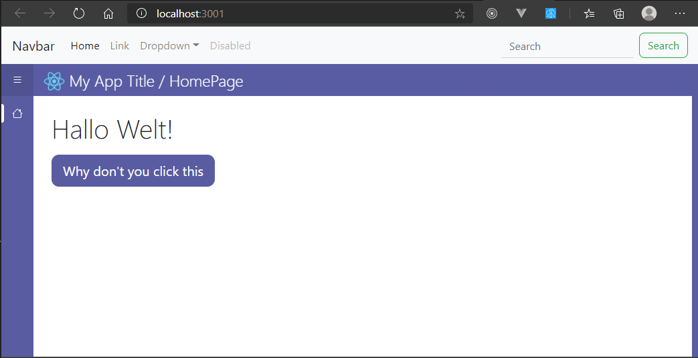

# Add custom header element on top

If you need a custom global header or nav bar on top of your application, follow this guide.

## Create the project
1. Create a new project with `npx create-react-app my-app --template blue`
2. Open the new folder `my-app` with your favorite code editor and start the debug service with `npm start`.


## Add the content

In this guide I'll add a [navbar from Bootstrap](https://getbootstrap.com/docs/4.5/components/navbar/). 
1. Open `./src/App.js` with the code editor. Here you should find the `<Grid />` component.
2. Wrap the Grid component around a Fragment (`<></>`):
```jsx
function App() {
    return (
        <>
            <Grid
                {/* ... */}
            />
        </>
    )
}
```
3. Put the markup code for the navbar above the Grid inside of the Fragment.\
Here is the full code:

```jsx
import React from "react"
import { Grid, SidebarMenu, MenuItem } from "blue-react"
import { List, House, XCircleFill, InfoCircleFill, CheckCircleFill, ExclamationCircleFill } from "react-bootstrap-icons"

import HomePage from "./pages/HomePage"

import "./styles/main.scss"

function App() {
    return (
        <>
            <nav className="navbar navbar-expand-lg navbar-light bg-light">
                <a className="navbar-brand" href="#">Navbar</a>
                <button className="navbar-toggler" type="button" data-toggle="collapse" data-target="#navbarSupportedContent" aria-controls="navbarSupportedContent" aria-expanded="false" aria-label="Toggle navigation">
                    <span className="navbar-toggler-icon" />
                </button>
                <div className="collapse navbar-collapse" id="navbarSupportedContent">
                    <ul className="navbar-nav mr-auto">
                        <li className="nav-item active">
                            <a className="nav-link" href="#">Home <span className="sr-only">(current)</span></a>
                        </li>
                        <li className="nav-item">
                            <a className="nav-link" href="#">Link</a>
                        </li>
                        <li className="nav-item dropdown">
                            <a className="nav-link dropdown-toggle" href="#" id="navbarDropdown" role="button" data-toggle="dropdown" aria-haspopup="true" aria-expanded="false">
                                Dropdown
                            </a>
                            <div className="dropdown-menu" aria-labelledby="navbarDropdown">
                                <a className="dropdown-item" href="#">Action</a>
                                <a className="dropdown-item" href="#">Another action</a>
                                <div className="dropdown-divider" />
                                <a className="dropdown-item" href="#">Something else here</a>
                            </div>
                        </li>
                        <li className="nav-item">
                            <a className="nav-link disabled" href="#" tabIndex={-1} aria-disabled="true">Disabled</a>
                        </li>
                    </ul>
                    <form className="form-inline my-2 my-lg-0">
                        <input className="form-control mr-sm-2" type="search" placeholder="Search" aria-label="Search" />
                        <button className="btn btn-outline-success my-2 my-sm-0" type="submit">Search</button>
                    </form>
                </div>
            </nav>

            <Grid
                expandSidebar
                sidebarToggleIconComponent={<List />}
                pages={[
                    {
                        name: "home",
                        component: <HomePage />
                    }
                ]}
                statusIcons={{
                    danger: <XCircleFill />,
                    info: <InfoCircleFill />,
                    success: <CheckCircleFill />,
                    warning: <ExclamationCircleFill />
                }}
            >
                <SidebarMenu>
                    <MenuItem href="#" icon={<House />} label="Home" isHome />
                </SidebarMenu>
            </Grid>
        </>
    )
}

export default App
```

It's also a good idea to put the navbar to its own component and import it instead.


## Add stylesheet
Some components of Blue React are fixed to the very top of the document. So make this changes, so they won't be overlapped.
1. Open ./src/styles/main.scss with the code editor.
2. Place this at the very end of the file:
```scss
$own-header-height: 56px;

.blue-app-header,
.blue-app-sidebar-toggler {
    top: $own-header-height;
}

.blue-app-sidebar {
    top: $normal-size + $own-header-height;
}
```
If the height of your custom element is different, just change the value of `$own-header-height`.

Your site should now look like this:
