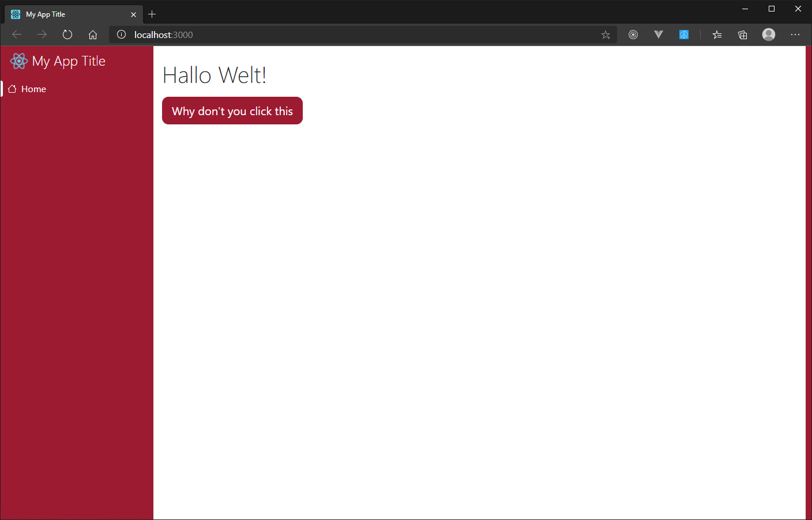

# Headerless site

By default, Blue React is designed to have a header bar at the top of each page. But you can disable this, if you don't want to have it and only want the app logo and title to be appeared on the sidebar.

## Create the project
1. Create a new project with `npx create-react-app my-headerless-app --template blue`
2. Open the new folder `my-headerless-app` with your favorite code editor and start the debug service with `npm start`.

## Enable the headerlessness

### Global app changes
1. Open `./src/App.js` with the code editor. Here you should find the `<Grid />` component.
2. Add the prop `disableHeaders` to the Grid component:
```jsx
<Grid
    expandSidebar
    sidebarToggleIconComponent={<List />}
    pages={[
        {
            name: "home",
            component: <HomePage />
        }
    ]}
    statusIcons={{
        danger: <XCircleFill />,
        info: <InfoCircleFill />,
        success: <CheckCircleFill />,
        warning: <ExclamationCircleFill />
    }}
    disableHeaders // <- Add this prop
>
    {/* ... */}
</Grid>
```
3. Now you need to import some things in `./src/App.js`:
```jsx
import { Grid, SidebarMenu, MenuItem, HeaderTitle } from "blue-react" // <- Add HeaderTitle

// ...

import { appLogo, appTitle } from "./shared" // I added the whole line
```
4. Insert the `<HeaderTitle />` component inside of the Grid at the top above `<Sidebar>`:
```jsx
        <Grid
            /* ... */
        >
            <HeaderTitle logo={appLogo} appTitle={appTitle} sidebar /> {/* <- Add this */}

            <SidebarMenu>
                <MenuItem href="#" icon={<House />} label="Home" isHome />
            </SidebarMenu>
        </Grid>
```

### Remove header from each page
Your app logo and title now will only appear when the sidebar is expanded and won't need a header bar anymore.

The `<Header />` component is inside of each page component. You can now delete all them. On this project we only have `./src/pages/HomePage.js`, so I will delete it there:
1. Open `./src/pages/HomePage.js` in your code editor. Its content will look like this:
```jsx
import React from "react"
import { Page, Header, HeaderTitle, Body, FluentBtn } from "blue-react"

import { appLogo, appTitle, getPhrase as _ } from "../shared"

function HomePage() {
    return (
        <Page>
            <Header>
                <HeaderTitle logo={appLogo} appTitle={appTitle}>HomePage</HeaderTitle>
            </Header>

            <Body containerClass="container">
                <h1 className="mt-4 mb-3">{_("HELLO_WORLD")}</h1>

                <FluentBtn
                    className="btn btn-lg btn-primary"
                    onClick={() => alert(_("HELLO_WORLD"))}
                >
                    Why don't you click this
                </FluentBtn>
            </Body>
        </Page>
    )
}

export default HomePage
```
2. Delete `<Header>`, `</Header>` and everything inside. You can also remove all imports which won't be needed anymore:
```jsx
import React from "react"
import { Page, Body, FluentBtn } from "blue-react"

import { getPhrase as _ } from "../shared"

function HomePage() {
    return (
        <Page>
            <Body containerClass="container">
                <h1 className="mt-4 mb-3">{_("HELLO_WORLD")}</h1>

                <FluentBtn
                    className="btn btn-lg btn-primary"
                    onClick={() => alert(_("HELLO_WORLD"))}
                >
                    Why don't you click this
                </FluentBtn>
            </Body>
        </Page>
    )
}

export default HomePage
```

Your site should now look like this:
